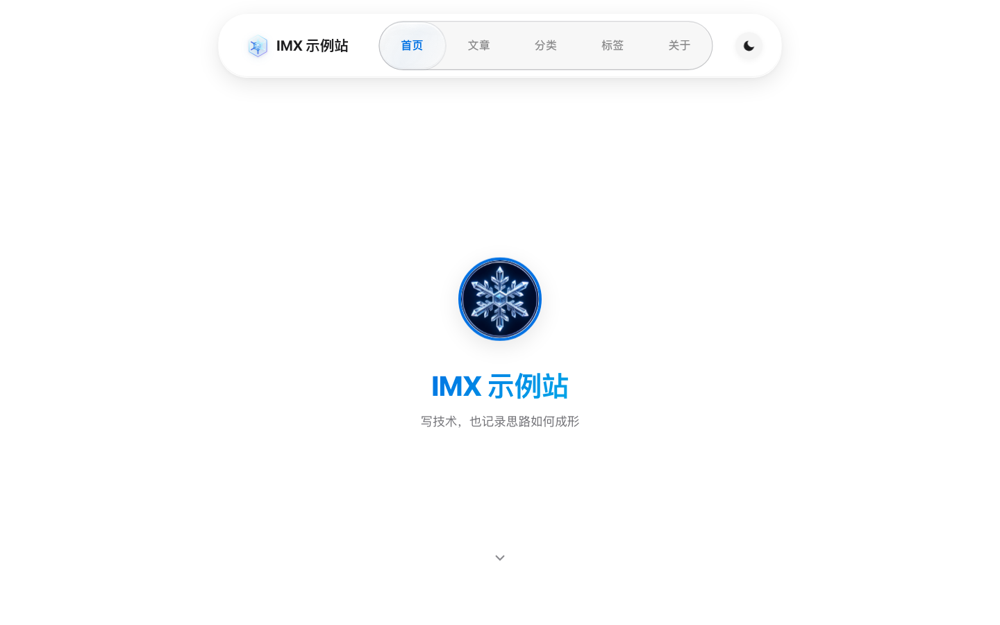
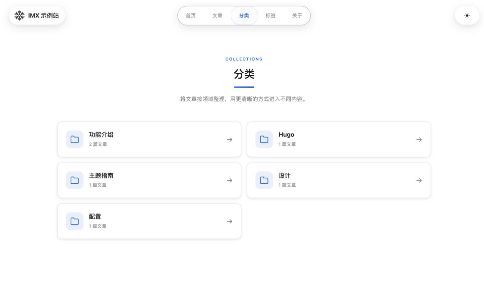
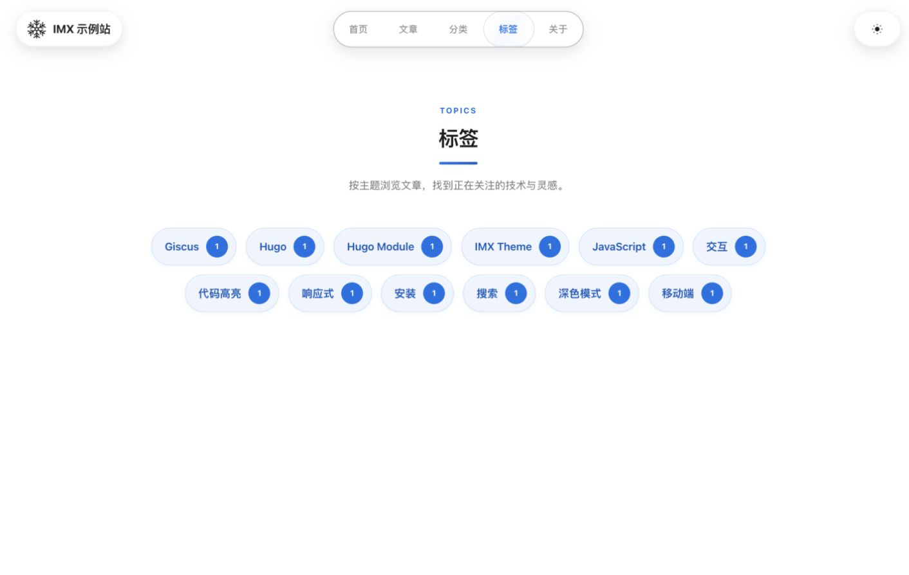

<p align="center">
  
</p>

# Hugo Theme IMX

IMX 是一个面向中文博客的 Hugo 主题，通过 Hugo Module 安装。它包含文章列表、分类与标签、站内搜索、文章目录、代码复制和 Giscus 评论，适合技术笔记和长期写作。

## 界面预览



## 主要功能

- 只使用 Hugo Module 安装和更新
- 桌面端与移动端导航
- 带弹性滑块的玻璃导航栏
- 浅色、深色和自动三种主题模式
- 首页、文章列表、分类、标签和关于页面
- 基于首页 JSON 输出的站内搜索
- 文章目录、阅读进度和代码复制
- 可选的 Giscus 评论
- SEO、Open Graph、Twitter Card 和 RSS
- 内置雪花 Logo、头像、文章封面、分享图和 favicon
- 通用界面使用系统字体栈，文章页自托管 Inter 与 Noto Serif SC WOFF2 字体，不请求远程字体服务

分类页和标签页：





## 环境要求

- Hugo Extended `0.112.0` 或更高版本
- Go `1.20` 或更高版本

主题使用 Hugo Module，并在根目录 `hugo.toml` 的 `[module.hugoVersion]` 中声明最低 Hugo 版本和 Extended 要求；`go.mod` 声明 Go 版本。Node.js 只用于维护者运行自动化测试，普通站点构建不需要 Node.js。

```bash
hugo version
go version
```

## 安装

如果站点还没有 `go.mod`，先在站点根目录执行：

```bash
hugo mod init github.com/your-name/your-site
```

在 `hugo.toml` 中导入主题：

```toml
[module]
  [[module.imports]]
    path = "github.com/c-x-x/hugo-theme-imx"
```

安装最新正式版并启动本地预览：

```bash
hugo mod get github.com/c-x-x/hugo-theme-imx@latest
hugo mod tidy
hugo server
```

如果需要固定到某个版本，把 `@latest` 改成对应的 Release 版本号即可，例如 `@v1.0.0`。

更新主题：

```bash
hugo mod get github.com/c-x-x/hugo-theme-imx@latest
hugo mod tidy
```

主题不使用 `theme = "..."` 配置，也不需要复制到站点的 `themes` 目录。

## 体验示例站

如果只是想先看看主题效果，不需要新建 Hugo 站点，可以直接下载 Release 源码包运行内置示例站。

1. 打开 [Releases](https://github.com/c-x-x/hugo-theme-imx/releases)，下载最新版本的 `Source code (zip)` 或 `Source code (tar.gz)`。
2. 解压后进入主题目录：

```bash
cd hugo-theme-imx-*
```

3. 启动示例站：

```bash
hugo server --source exampleSite
```

4. 浏览器打开终端中显示的本地地址，通常是 `http://localhost:1313/`。

示例站的 `exampleSite/go.mod` 已经用本地 `replace` 指向当前主题源码，所以下载 Release 源码包后可以直接预览，不需要把主题复制到 `themes` 目录，也不需要先发布到自己的仓库。

## 最小配置

```toml
baseURL = "https://example.com/"
defaultContentLanguage = "zh-cn"
locale = "zh-CN"
title = "我的博客"

[params]
  description = "站点描述"
  subtitle = "首页副标题"
  author = "你的名字"
  mainSections = ["posts"]

[outputs]
  home = ["HTML", "RSS", "JSON"]

[module]
  [[module.imports]]
    path = "github.com/c-x-x/hugo-theme-imx"
```

搜索依赖首页的 JSON 输出，请保留 `outputs.home` 中的 `JSON`。

## 导航菜单

```toml
[[menus.main]]
  name = "首页"
  pageRef = "/"
  weight = 10

[[menus.main]]
  name = "文章"
  pageRef = "/posts"
  weight = 20

[[menus.main]]
  name = "分类"
  url = "/categories/"
  weight = 30

[[menus.main]]
  name = "标签"
  url = "/tags/"
  weight = 40

[[menus.main]]
  name = "关于"
  pageRef = "/about"
  weight = 50
```

未配置菜单时，主题会使用上面这五项作为默认值。

## 站点参数

```toml
[params]
  description = "站点描述"
  subtitle = "首页副标题"
  author = "作者"
  keywords = ["Hugo", "博客"]
  logo = "/images/logo.svg"
  logoLight = "/images/logo-light.svg"
  logoDark = "/images/logo-dark.svg"
  avatar = "/images/avatar.jpg"
  defaultImage = "/images/default-cover.jpg"
  defaultOGImage = "/images/default-og.jpg"
  favicon = "/images/favicon.svg"
  faviconLight = "/images/favicon-light.svg"
  faviconDark = "/images/favicon-dark.svg"
  mainSections = ["posts"]
  footerText = "页脚文字"

  [params.social]
    github = "https://github.com/your-name"
    email = "hello@example.com"
```

`logo` 用于顶部导航，`avatar` 用于首页和关于页面。`logoLight`、`logoDark`、`faviconLight` 和 `faviconDark` 可分别覆盖浅色与深色素材；未配置模式专用素材时，自定义的 `logo` 和 `favicon` 会在深浅色中复用同一份文件。

`[params.social]` 当前只用于页脚社交链接：`github` 显示 GitHub 图标链接，`email` 显示邮件链接。它不会自动生成 About 页联系方式。

未配置图片时，主题使用以下内置资源：

| 参数 | 默认值 |
| --- | --- |
| `logo` | `/images/imx/logo.svg` |
| `logoLight` | `logo` 的值；未配置 `logo` 时为 `/images/imx/logo.svg` |
| `logoDark` | `/images/imx/logo-dark.svg` |
| `avatar` | `/images/imx/default-avatar.jpg` |
| `defaultImage` | `/images/imx/default-cover.jpg` |
| `defaultOGImage` | `/images/imx/default-og.jpg` |
| `favicon` | `/images/imx/favicon.svg` |
| `faviconLight` | `favicon` 的值；未配置 `favicon` 时为 `/images/imx/favicon.svg` |
| `faviconDark` | `/images/imx/favicon-dark.svg` |

文章没有设置 `image` 时，列表卡片使用 `defaultImage`。页面没有独立图片时，分享元数据使用 `defaultOGImage`。

## About 页访客信息

使用 `layout = "about"` 的 About 页默认显示访客 IP 和地区。页面进入后依次请求 `ipwho.is`、`ipapi.co`、`freeipapi.com` 和 `api.ip.sb`，单次请求超时为 2.8 秒；成功结果在当前浏览器会话中缓存 10 分钟。此功能当前没有关闭参数，显示内容为“您的IP”和“您的位置”。

访客请求只在页面存在对应访客信息元素时发起。部署站点前应根据适用的隐私政策和法律要求说明这些第三方请求。

## 主题模式

主题按钮按以下顺序切换：

```text
手动浅色 -> 手动深色 -> 自动
```

自动模式按东八区时间切换：

- `08:00` 至 `17:59` 使用浅色
- `18:00` 至次日 `07:59` 使用深色

选择结果保存在浏览器本地，并在页面内容绘制前应用。

## Giscus 评论

先在 [giscus.app](https://giscus.app/zh-CN) 为评论仓库生成配置，然后填写：

```toml
[params.giscus]
  enabled = true
  repo = "your-name/comments"
  repoId = "R_..."
  category = "Announcements"
  categoryId = "DIC_..."
  mapping = "pathname"
  lang = "zh-CN"
```

评论框在首次加载时读取站点当前主题，之后会跟随主题按钮实时切换。默认会使用主题内置的 IMX 浅色/深色评论样式。需要完全自定义时，可以额外填写 `lightTheme` 和 `darkTheme`，值可以是 Giscus 支持的主题名称或自定义主题 CSS URL。

## 文章 Front Matter

```toml
+++
title = "文章标题"
date = 2026-06-22T09:00:00+08:00
description = "文章摘要"
image = "/images/posts/example.jpg"
categories = ["Hugo"]
tags = ["主题", "教程"]
toc = true
+++
```

`image` 可以省略。将 `toc` 设置为 `false` 可关闭当前文章的目录。

## 本地开发

仓库中的示例站同样通过 Hugo Module 加载主题：

```bash
hugo server --source exampleSite
```

构建检查：

```bash
hugo --source exampleSite --destination /tmp/hugo-theme-imx-public --cacheDir /tmp/hugo-theme-imx-cache --gc --minify --noBuildLock
```

`exampleSite/go.mod` 使用本地 `replace` 指向仓库根目录，仅用于开发。

浏览器回归测试只用于主题维护，不影响普通用户构建。首次运行需要 Node.js 18 或更高版本：

```bash
npm ci
npx playwright install chromium
npm run check:js
npm run test:e2e
```

Playwright 会在内存中启动示例站，覆盖五种视口、主要页面、主题模式、导航、Dock、目录和横向溢出，并在 `test-results` 中保存首页、长文章和 About 页的浅色/深色截图。

## 目录结构

```text
hugo-theme-imx/
├── archetypes/
├── assets/
│   ├── css/             # 按 tokens、页面组件、响应式和覆盖顺序拆分
│   └── js/
│       ├── core/        # 存储、媒体查询、URL、DOM 与动画通用方法
│       ├── main.js      # Hugo js.Build 入口
│       └── *.js         # 主题、导航、Dock、首页、搜索、目录等功能模块
├── .github/workflows/   # 构建与 Playwright 回归检查
├── exampleSite/
├── images/
├── layouts/
├── static/
│   └── fonts/imx/       # 自托管字体及对应 OFL 许可证
├── tests/
├── hugo.toml            # Hugo Module 兼容要求
├── go.mod
├── package.json         # 仅用于维护者测试
├── theme.toml
└── README.md
```

模板通过 Hugo Pipes 按固定顺序拼接 CSS，随后压缩并生成指纹；JavaScript 由 Hugo `js.Build` 解析模块、合并、压缩并生成指纹。浏览器最终各加载一个主题 CSS 和一个主题 JavaScript 文件，不要求额外执行 npm 构建。

## 参与维护

提交 Issue 或 Pull Request 前，请阅读 [CONTRIBUTING.md](CONTRIBUTING.md)。安全问题的报告方式见 [SECURITY.md](SECURITY.md)。

## 许可证

主题代码和项目自有素材按 [MIT License](LICENSE) 分发。Inter 与 Noto Serif SC 字体分别按 SIL Open Font License 1.1 分发，完整文本位于 `static/fonts/imx/`；其他第三方内容见 [CREDITS.md](CREDITS.md)。
