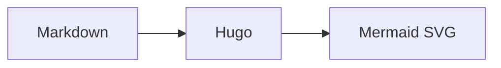

+++
title = "Mermaid 流程图回归样例"
date = 2026-09-05T20:00:00+08:00
description = "用于验证 Mermaid 围栏代码块的 Hugo 输出与浏览器渲染。"
type = "regression"
toc = false
url = "/mermaid-regression/"
+++

```mermaid
flowchart LR
    A[Markdown] --> B[Hugo]
    B --> C[Mermaid SVG]
```
